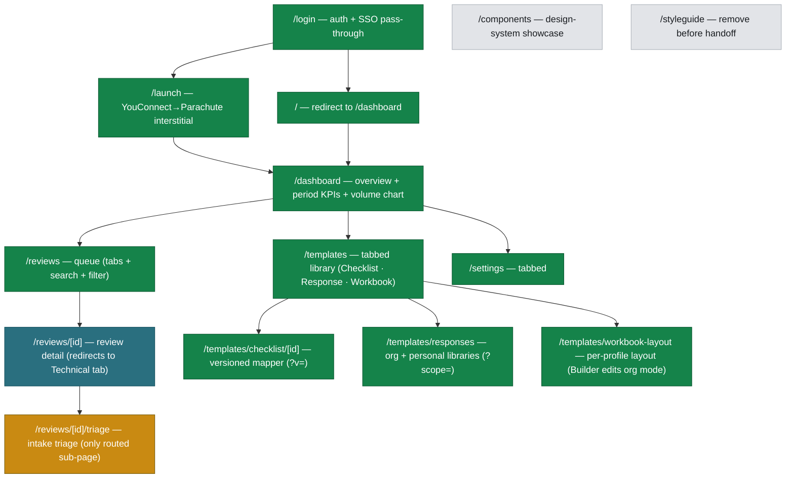
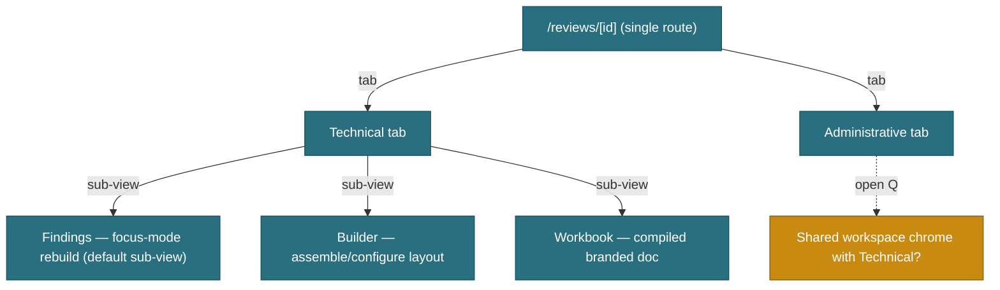
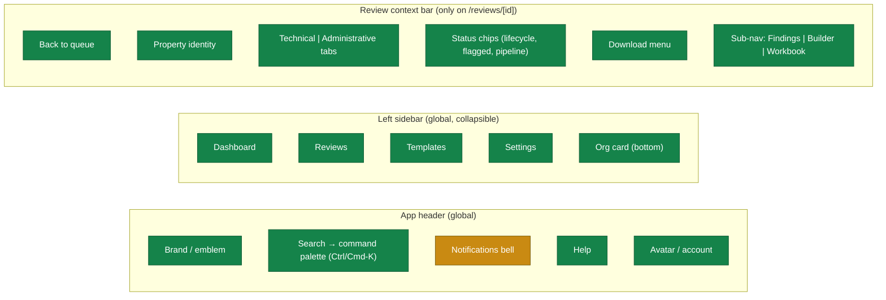
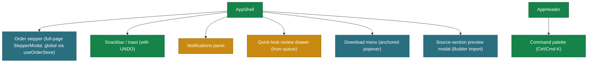

# Parachute v2 — IA Map (diagrams + decisions log)

> Visual companion to the prose `parachute-v2-ia-route-map.md`. Built in the Jun 16 2026
> IA/feature-mapping session from the POC inventory. Mermaid renders on GitHub.
> **Card-board view** (FigJam-style, with thumbnails + per-screen descriptions): open
> `parachute-v2-ia-board.html` in a browser — same IA, screen-card format, living artifact.
> **Living doc** — the decisions log at the bottom is updated as Phase-3 calls are made.
>
> Status legend (node colors): 🟩 **Built** · 🟦 **Locked in plans** · 🟧 **Not decided** (Phase 3) · ⬜ **Temporary / dev tool**.

---

## 1. Route tree (Next.js App Router)

Only real URLs appear here. In-review tabs/sub-views are **state, not routes** (see §2).

**Settings tabs** (in-page, not routes): Organization · Review defaults · Compliance · My profile · Preferences.

---

## 2. Review detail — internal IA (state, not routes)

`/reviews/[id]` is **one route**. Technical / Administrative are in-page **tabs**; Findings / Builder / Workbook are **sub-views of the Technical tab**. None are routes; none appear in breadcrumbs. `…/triage` is the only routed sub-page. (Locked in `app/AGENTS.md`.)

---

## 3. Navigation model (three nav surfaces)

Primary "Order a review" is a **button + command-palette action**, not a nav destination (changed from the POC's "New Order" rail item).

---

## 4. Overlay / modal inventory (where each mounts)

Global overlays live in the shell, driven by a store — never mounted per-page.

---

## 5. Reconciliation vs. locked decisions

**Honored (no conflict):**
- One review route with in-page tabs + Technical sub-views; only triage routed.
- Nav = Dashboard · Reviews · Templates · Settings; Order is a global modal.
- Search = command palette; global overlays mounted in shell via stores.
- Dashboard (overview) split from Reviews (queue); StatBar is informational, not a filter.

**Gaps the map exposes (→ Phase 3):**
1. **Order completion target** — Run pipeline lands in the review or back in the queue?
2. **Quick-look review** — side drawer from the queue, or just open the route?
3. **Add-finding** (Technical) — inline form vs. modal; bulk "Accept all passes" affordance.
4. **Administrative chrome** — reuse the Technical focus-mode shell or a distinct UI?
5. **Workbook vs. Builder split** — how much customization is inline on the Workbook?
6. **Builder depth** — full 3-pane builder vs. simpler customize panel for v2 launch.
7. **Templates hub** — shape (cards / tabs / left-nav); checklist-mgmt home (Templates vs. Settings); response-template editor as route vs. panel.
8. **Triage placement** — own route vs. state/banner inside the workspace.
9. **Notifications** — model (email vs. in-app) + whether the bell gets a panel now.

---

## 6. Decisions log

Updated as Phase-3 calls land. `OPEN` = to decide; record the chosen pattern + CTA priority + date.

| # | Decision | Interaction pattern | CTA priority | Status |
|---|---|---|---|---|
| 1 | Order completion target | **Route into the new review**, Technical tab, running state (S1–S5 shimmer) | "Run pipeline" primary (navy); "Back to queue" secondary | ✅ DECIDED Jun 16 |
| 2 | Quick-look a review from queue | **Side-drawer quick-look** (peek: status, findings summary, next action, download); full route on open | "Open review" primary (navy); "Download" secondary | ✅ DECIDED Jun 16 |
| 3 | Add-finding + bulk accept | Add-finding = **right side-drawer form** (reuses quick-look drawer pattern); "Accept all passes" = secondary toolbar button | "Add" primary (navy) in drawer; bulk-accept secondary outline | ✅ DECIDED Jun 16 |
| 4 | Administrative workspace chrome | **Shared focus-mode shell** (list rail + focus pane + docked source); attestation items instead of findings | Yes/No/NA as the in-pane primary set; "Confirm routine answers" + "Sign" follow Technical's hierarchy | ✅ DECIDED Jun 16 |
| 5 | Workbook ↔ Builder customization split | **Builder owns customization**; Workbook = clean compiled doc + lifecycle only | Workbook: "Sign" primary → "Complete"/"Return" follow; no customization CTAs on the doc | ✅ DECIDED Jun 16 |
| 6 | Builder depth for v2 | **Focused customize panel** (reorder/exclude sections, show-hide, theme, font, risk labels). Full 3-pane builder + appraisal-section import + org section-library publish **deferred** | "Preview workbook" primary; settings are toggles, not CTAs | ✅ DECIDED Jun 16 |
| 7 | Templates hub shape / checklist home / editor | ~~Hub = **cards → sub-routes**~~ → **REVISED Jun 19 to tabs of kinds + versioning + a default model — see §9.** Checklist Mapper **home = Templates** (Settings→Compliance links in) and Response-template editor = **master/detail within its sub-route** still hold. | ↳ §9 supersedes the hub-shape + per-sub-route action parts | ✅ DECIDED Jun 16 · 🔄 revised Jun 19 |
| 8 | Triage placement | **Own route** `/reviews/[id]/triage` (the only routed review sub-page); linked from the Dashboard "Intake triage" tile | "Override & admit" primary (navy, requires audited reason → starts pipeline); "Confirm & return to appraiser" secondary (outline, confirm) | ✅ DECIDED Jun 16 |
| 9 | Notifications model + bell panel | **In-app bell panel** (demoable: review ready / returned / assigned / overdue); **email = production channel, engineering-owned** | Panel items deep-link to the review; no standalone primary CTA | ✅ DECIDED Jun 16 |

**All 9 Phase-3 items decided (Jun 16 2026). No open IA items remain.**

---

## 7. Reviews queue — IA & state model (settled Jun 17–18 2026)

Follow-on decisions made while rebuilding `/reviews` from the POC's team queue. Full
write-up in `parachute-v2-early-specs.md` §9; locked build rules in `app/AGENTS.md`.

| # | Decision | Resolution | Status |
|---|---|---|---|
| Q1 | Org / persona model | **Single bank, multi-branch.** User = reviewer/chief appraiser in the bank's review **department** (team view). Org = the bank (org-card context, **not** a row column). Per-row parties = reviewer · external **appraisal firm** (fee appraiser, the send-back target) · loan/property. | ✅ DECIDED Jun 17 |
| Q2 | Tabs vs filters | **Tabs partition by lifecycle stage** (All · Needs action · In pipeline · Sent back · Completed · Intake) — Ed's "separate the stages." Scope filters → see Q7. | ✅ DECIDED Jun 17, refined Q7 |
| Q3 | Columns | **Parties-rich aligned grid:** Property & parties (reviewer avatar + firm/loan/type) · Type · Pipeline · Findings · Due · Next action · `⋯`. **Risk column dropped** (not a queue signal). | ✅ DECIDED Jun 17, superseded by Q8 |
| Q4 | "Cooked-up" statuses | **No Status column.** State is **derived** from Pipeline (phase) + Findings (outcome) + Type (kind) via `lib/review-lifecycle.ts`. `ReviewStatus` = honest phases only (`intake · autorejected · running · in_review · returned · completed`). | ✅ DECIDED Jun 18 |
| Q5 | Pipeline tracker | **Journey track** (`PipelineTracker`): S1–S5 segments — done filled · active **static half-fill** · idle. The single petrol "AI working" cue is the **running badge's pulsing dot** stacked above the track; active stage name on the badge; hover tooltip = light panel with a vertical stepper + climbing stage %. Word-states for pre/post-pipeline. | ✅ DECIDED Jun 17, restyled Jun 18 |
| Q6 | Next action / row actions | **One derived primary** per row + `⋯` `ActionMenu`, now in **one merged right-aligned Actions cell** (Q8); no "Next action" header. | ✅ DECIDED Jun 17, refined Q8 |
| Q7 | Filter encapsulation | **One `Filters` popover** (`QueueFilters` molecule — portal, staged draft, Apply/Clear) + removable **active-filter chip** strip. **All five facets are the SAME multi-select dropdown**: **Findings (severity color cues) · Type · Reviewer (avatar + name, "You" tag) · Appraisal firm · Due (Overdue/Due soon/SLA paused)**. Every facet uses **tri-state select-all** (`MultiSel = "all" | string[]`): **"All" row toggles select-all↔deselect-all**, `"all"` default (every row checked, **no chip** — thumb rule: all-selected = default), subset → master indeterminate (full collapses back to `"all"`), `[]` → none (matches nothing, shows a "No …" chip). Isolate one = click All to clear, then check it. **"Mine" = checking your own name**; **"severity" filter killed — it's the honest Findings facet** (`findingsKey()`). **Due column** = neutral date + trailing urgency marker (amber clock = soon, red triangle = overdue), magnitude in the marker's tooltip. **Download** primary (completed) = icon-only outline + tooltip; `⋯` = "More options" tooltip. `Tooltip` animates via Framer (rise+fade+scale, two-layer to avoid the centering-transform clash). Toolbar = tabs + search + Filters + Order CTA on one line. | ✅ DECIDED Jun 18 |
| Q8 | Column refinements | **Reviewer = its own narrow avatar-only column** (name on hover), pulled out of Property. **Type = spaced chips** (can be both). **Actions merged** into one right-aligned cell. Property header simplified to `Property`. | ✅ DECIDED Jun 18 |
| Q9 | Column behaviors | **Sortable headers** (all but Actions): click cycles asc → desc → smart default; active ↑/↓, idle faint ⇅. **Column-config gear** in the Actions header toggles visibility — **Property + Actions locked-on**, other five hideable, **session-only**. **Dynamic grid** (`gridTemplate(visible)`). **Property title+subtext ellipsise responsively** with tooltip only-when-clipped (`TruncText`). Config in `review-columns.ts`; sort in `useReviewQueue`. | ✅ DECIDED Jun 18 |
| Q10 | Tab set & order | **`All · Needs action · In pipeline · Intake · Completed`.** "Sent back"/returned **removed pending client** ([client Q1](parachute-v2-client-questions.md)); **auto-rejected folds into Needs action** (`lifecycleBucket: autorejected → needs_action`), Intake = plain `intake` only. | ✅ DECIDED Jun 18 (revisit after client) |
| Q11 | Auto-rejected presentation | Pipeline = red **"Auto Rejected"** badge (was "Blocked at intake"); **Due = `—`** (was "SLA paused"). | ✅ DECIDED Jun 18 |
| Q12 | Intake (pre-order) presentation | Pipeline = **"New"** info-pill, or **"New from YC"** (YouConnect glyph) when `source==="yc"` — was "Awaiting order". | ✅ DECIDED Jun 18 |
| Q13 | Completed presentation | Pipeline label **"Completed"** (was "Done"); hover card adds a **"Reviewed and signed by {reviewer}" footnote**; **Due shows its date** (no marker) instead of `—`. | ✅ DECIDED Jun 18 |
| Q14 | Quiet wait-actions | The grey `Running…` / `With appraiser` next-action labels are **removed** — those rows show only the `⋯` menu. | ✅ DECIDED Jun 18 |
| Q16 | Tab motion & search scoping | Tab bars (`Tabs` + `SegmentedControl`) use a **Framer `layoutId` sliding pill** (queue + settings). **Search scopes the tabs**: counts reflect the query and zero-match tabs are **hidden** while searching (All stays; active tab falls back to All via `effectiveTab`). | ✅ DECIDED Jun 18 |
| Q15 | Column sizing & alignment | Every data column is **`minmax(floor, weight-fr)`** (in `review-columns.ts`) so hidden columns make the rest **spread** (was: only Property flexed). **All data columns + headers left-aligned** (Reviewer was centred); Actions right, floored to the widest button (`minmax(136px, max-content)`). Property narrowed; Pipeline gets the most secondary space. All dot-states (**Ready / Completed / running**) render the label as a **pill badge stacked on top** of the S1–S5 track (ready/completed green, running petrol). CSS `.qrow`/`.qcols` default template kept in sync (skeleton uses it). | ✅ DECIDED Jun 18 |

---

## 8. Order a review — flow decisions (settled Jun 18 2026)

Made while rebuilding the Order stepper from the POC's single-screen "checkout." Full
write-up in `parachute-v2-early-specs.md` §1; locked build rules in `app/AGENTS.md`.

| # | Decision | Resolution | Status |
|---|---|---|---|
| O1 | Stepper shape | **Three steps** — `Source · Configure · Summary` (final step relabeled from "Confirm & run"; `ORDER_STEP` key stays `confirm`). The POC's separate type/reviewer/options (each ~1 click) fold into one **Configure** step. Each step's content is one white `.ord-card` on the modal canvas. | ✅ DECIDED Jun 18 |
| O2 | Summary surface (no rail) | **No progressive summary rail.** An earlier build added a persist-then-graduate "Order summary" rail on Source + Configure; **reversed Jun 18 2026** — with only two steps before Summary it wasn't worth the width. Instead the **Summary step is the review surface**: a sectioned card (Appraisal · Review type · Reviewer & schedule · Options) where **each section has an ✎ Edit button that jumps back to its step**. `StepperModal` keeps an optional `aside` slot for future wizards; the Order flow doesn't use it. | ✅ DECIDED Jun 18 (rail reversed same day) |
| O3 | Standalone upload flow | **Upload-first.** The dropzone is the hero; on parse, property fields (address/type/lender/loan#/firm/due) **AI-autofill** (editable verify-and-correct). Mirrors how YC deliveries arrive pre-filled — both source modes converge on "verify the property." | ✅ DECIDED Jun 18 |
| O4 | Second review (in-queue YC) | Selecting a YC delivery **already in the queue** is **allowed, with an amber "already in your queue — continue only for an intentional second review" warning** (not blocked; no separate route). | ✅ DECIDED Jun 18 |
| O5 | Source data | New `YcDelivery` seed (`yc-deliveries.seed.ts`) backs the YouConnect inbox: property, loan#, type, delivered date, bank, doc meta, `status: new \| in_queue` (+ `existingReviewId` for second-review detection). | ✅ DECIDED Jun 18 |

---

## 9. Templates — versioning, defaults & edit-centric cards (settled Jun 19 2026)

Follow-on decisions from iterating on `/templates` (supersedes the hub-shape parts of
decision #7). Full write-up in `parachute-v2-templates-build-plan.md`; locked build
rules in `app/AGENTS.md`.

| # | Decision | Resolution | Status |
|---|---|---|---|
| T1 | Hub shape | **Tabs of kinds** (Compliance Checklists · Response Templates · Workbook Layout), in the `.pagehead` band — reverses #7's "cards → sub-routes." Each tab = a list of full-width artifact cards; editors stay drill-in routes. | 🔄 REVISED Jun 19 (was #7) |
| T2 | Versioning (Checklist + Workbook) | Families hold `versions[]` (`status: published \| draft \| archived`); **≤1 published + ≤1 draft**, archived kept (in-flight reviews stay pinned). Resolve via `lib/template-versions`; **no published-pointer**. Card hero = published version; collapsible footer = the version-history table. **Response does NOT version** (live snippet library). | ✅ DECIDED Jun 19 |
| T3 | Lifecycle | **Draft → Publish; Promote = rollback.** Editing creates/continues the single draft; "Publish new version" freezes it active & archives the prior; "Promote" re-publishes an archived snapshot. A new `.docx` upload lands as a draft. | ✅ DECIDED Jun 19 |
| T4 | Which template applies (defaults) | **Checklist = a single org default** (`isDefault`, store-enforced; order picker defaults to it + AI-recommends; reviewer overrides per order). **Workbook = one default per review profile** (`profile` + `isDefault`; auto-inherited, tweaked per review in the Builder). Both transferable via the card `⋯` "Set as default" **and** Settings → Review defaults (single source of truth). | ✅ DECIDED Jun 19 |
| T5 | Edit-centric card actions | **Title → details/view** (link); **one primary write button** (Checklist → Edit/Continue draft · Workbook → Open · Response → Open); **secondary actions in a hero `⋯`** (Set as default / Duplicate / Delete; the default can't delete/re-default itself). Dropped "New version" / "View current" / "New template" buttons (new versions are saved inside the editor; response snippets are created inside the library). | ✅ DECIDED Jun 19 |
| T6 | Order ↔ Templates wiring | Order **Configure** has a "Templates for this review" sub-section: an **admin checklist picker** (default + "AI-recommended" / "override — audited") and a **read-only inherited workbook-layout** row (profile-derived; editable in the Builder, NOT at order). Summary echoes both. Workbook stays read-only at order (kept inherited — per-review layout edits live in the Builder, decisions #5/#6). | ✅ DECIDED Jun 19 |
| T7 | Checklist creation | **Deferred** pending client clarity on the `.docx` ingest. The upload wizard + `addChecklist` are kept **dormant** (unmounted); no create entry point in the UI. | ⏸️ DEFERRED Jun 19 |
| T8 | Dark-mode inputs | **Theme-aware in dark mode** (elevated dark fill, near-white ink, `color-scheme: dark` for native dropdowns/date pickers/autofill); **light mode keeps the client's white inputs**. Reverses the "white in both themes" client rule **in dark only** — flagged for Realwired ([client Q2](parachute-v2-client-questions.md)). | 🟡 CHANGED Jun 19, confirm w/ client |
| T9 | Overlay portal rule | **Every floating layer portals to `document.body` with fixed positioning** (tooltips, `⋯` menus, dropdowns, date pickers) so ancestor `overflow:hidden` can't clip them. `ActionMenu` migrated to this (was `position:absolute`, got clipped in cards/tables). Canonical impls: `Tooltip.tsx`, `ActionMenu.tsx`. | ✅ DECIDED Jun 19 |
