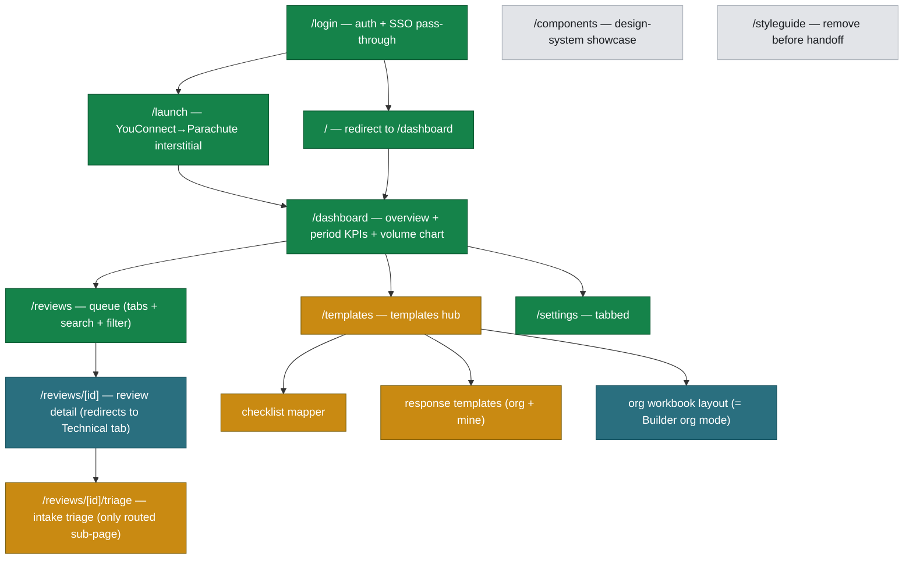
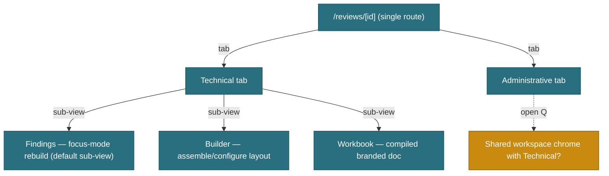
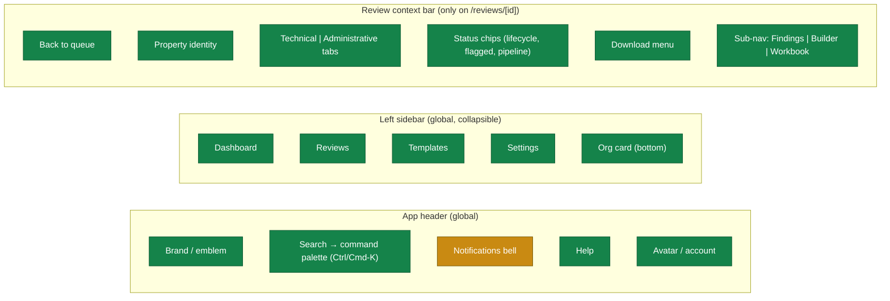
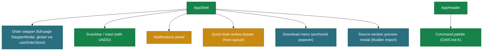

# Parachute v2 — IA Map (diagrams + decisions log)

> Visual companion to the prose `parachute-v2-ia-route-map.md`. Built in the Jun 16 2026
> IA/feature-mapping session from the POC inventory. Mermaid renders on GitHub.
> **Card-board view** (FigJam-style, with thumbnails + per-screen descriptions): open
> `parachute-v2-ia-board.html` in a browser — same IA, screen-card format, living artifact.
> **Living doc** — the decisions log at the bottom is updated as Phase-3 calls are made.
>
> Status legend (node colors): 🟩 **Built** · 🟦 **Locked in plans** · 🟧 **Not decided** (Phase 3) · ⬜ **Temporary / dev tool**.

---

## 1. Route tree (Next.js App Router)

Only real URLs appear here. In-review tabs/sub-views are **state, not routes** (see §2).

**Settings tabs** (in-page, not routes): Organization · Review defaults · Compliance · My profile · Preferences.

---

## 2. Review detail — internal IA (state, not routes)

`/reviews/[id]` is **one route**. Technical / Administrative are in-page **tabs**; Findings / Builder / Workbook are **sub-views of the Technical tab**. None are routes; none appear in breadcrumbs. `…/triage` is the only routed sub-page. (Locked in `app/AGENTS.md`.)

---

## 3. Navigation model (three nav surfaces)

Primary "Order a review" is a **button + command-palette action**, not a nav destination (changed from the POC's "New Order" rail item).

---

## 4. Overlay / modal inventory (where each mounts)

Global overlays live in the shell, driven by a store — never mounted per-page.

---

## 5. Reconciliation vs. locked decisions

**Honored (no conflict):**
- One review route with in-page tabs + Technical sub-views; only triage routed.
- Nav = Dashboard · Reviews · Templates · Settings; Order is a global modal.
- Search = command palette; global overlays mounted in shell via stores.
- Dashboard (overview) split from Reviews (queue); StatBar is informational, not a filter.

**Gaps the map exposes (→ Phase 3):**
1. **Order completion target** — Run pipeline lands in the review or back in the queue?
2. **Quick-look review** — side drawer from the queue, or just open the route?
3. **Add-finding** (Technical) — inline form vs. modal; bulk "Accept all passes" affordance.
4. **Administrative chrome** — reuse the Technical focus-mode shell or a distinct UI?
5. **Workbook vs. Builder split** — how much customization is inline on the Workbook?
6. **Builder depth** — full 3-pane builder vs. simpler customize panel for v2 launch.
7. **Templates hub** — shape (cards / tabs / left-nav); checklist-mgmt home (Templates vs. Settings); response-template editor as route vs. panel.
8. **Triage placement** — own route vs. state/banner inside the workspace.
9. **Notifications** — model (email vs. in-app) + whether the bell gets a panel now.

---

## 6. Decisions log

Updated as Phase-3 calls land. `OPEN` = to decide; record the chosen pattern + CTA priority + date.

| # | Decision | Interaction pattern | CTA priority | Status |
|---|---|---|---|---|
| 1 | Order completion target | **Route into the new review**, Technical tab, running state (S1–S5 shimmer) | "Run pipeline" primary (navy); "Back to queue" secondary | ✅ DECIDED Jun 16 |
| 2 | Quick-look a review from queue | **Side-drawer quick-look** (peek: status, findings summary, next action, download); full route on open | "Open review" primary (navy); "Download" secondary | ✅ DECIDED Jun 16 |
| 3 | Add-finding + bulk accept | Add-finding = **right side-drawer form** (reuses quick-look drawer pattern); "Accept all passes" = secondary toolbar button | "Add" primary (navy) in drawer; bulk-accept secondary outline | ✅ DECIDED Jun 16 |
| 4 | Administrative workspace chrome | **Shared focus-mode shell** (list rail + focus pane + docked source); attestation items instead of findings | Yes/No/NA as the in-pane primary set; "Confirm routine answers" + "Sign" follow Technical's hierarchy | ✅ DECIDED Jun 16 |
| 5 | Workbook ↔ Builder customization split | **Builder owns customization**; Workbook = clean compiled doc + lifecycle only | Workbook: "Sign" primary → "Complete"/"Return" follow; no customization CTAs on the doc | ✅ DECIDED Jun 16 |
| 6 | Builder depth for v2 | **Focused customize panel** (reorder/exclude sections, show-hide, theme, font, risk labels). Full 3-pane builder + appraisal-section import + org section-library publish **deferred** | "Preview workbook" primary; settings are toggles, not CTAs | ✅ DECIDED Jun 16 |
| 7 | Templates hub shape / checklist home / editor | Hub = **cards → sub-routes**; Checklist Mapper **home = Templates** (Settings→Compliance links in); Response-template editor = **master/detail within its sub-route** | Per sub-route: one primary ("Publish version" / "New template"); rest secondary | ✅ DECIDED Jun 16 |
| 8 | Triage placement | **Own route** `/reviews/[id]/triage` (the only routed review sub-page); linked from the Dashboard "Intake triage" tile | "Override & admit" primary (navy, requires audited reason → starts pipeline); "Confirm & return to appraiser" secondary (outline, confirm) | ✅ DECIDED Jun 16 |
| 9 | Notifications model + bell panel | **In-app bell panel** (demoable: review ready / returned / assigned / overdue); **email = production channel, engineering-owned** | Panel items deep-link to the review; no standalone primary CTA | ✅ DECIDED Jun 16 |

**All 9 Phase-3 items decided (Jun 16 2026). No open IA items remain.**

---

## 7. Reviews queue — IA & state model (settled Jun 17–18 2026)

Follow-on decisions made while rebuilding `/reviews` from the POC's team queue. Full
write-up in `parachute-v2-early-specs.md` §9; locked build rules in `app/AGENTS.md`.

| # | Decision | Resolution | Status |
|---|---|---|---|
| Q1 | Org / persona model | **Single bank, multi-branch.** User = reviewer/chief appraiser in the bank's review **department** (team view). Org = the bank (org-card context, **not** a row column). Per-row parties = reviewer · external **appraisal firm** (fee appraiser, the send-back target) · loan/property. | ✅ DECIDED Jun 17 |
| Q2 | Tabs vs filters | **Tabs partition by lifecycle stage** (All · Needs action · In pipeline · Sent back · Completed · Intake) — Ed's "separate the stages." **Mine** → "Mine only" toggle; **Flagged** → severity filter. | ✅ DECIDED Jun 17 |
| Q3 | Columns | **Parties-rich aligned grid:** Property & parties (reviewer avatar + firm/loan/type) · Type · Pipeline · Findings · Due · Next action · `⋯`. **Risk column dropped** (not a queue signal). | ✅ DECIDED Jun 17 |
| Q4 | "Cooked-up" statuses | **No Status column.** State is **derived** from Pipeline (phase) + Findings (outcome) + Type (kind) via `lib/review-lifecycle.ts`. `ReviewStatus` = honest phases only (`intake · autorejected · running · in_review · returned · completed`). | ✅ DECIDED Jun 18 |
| Q5 | Pipeline tracker | **Segmented S1–S5 dots + state label** (`PipelineTracker` molecule); word-states for pre/post-pipeline phases. | ✅ DECIDED Jun 17 |
| Q6 | Next action / row actions | **One derived primary** per row (outline button; quiet text for waits) + **`⋯` `ActionMenu`** for secondary (Open · Triage · Download). | ✅ DECIDED Jun 17 |
