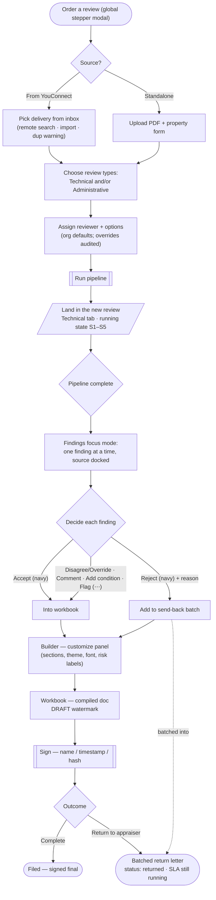
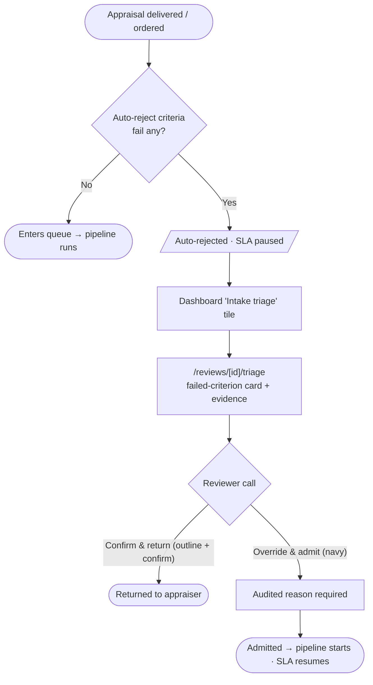
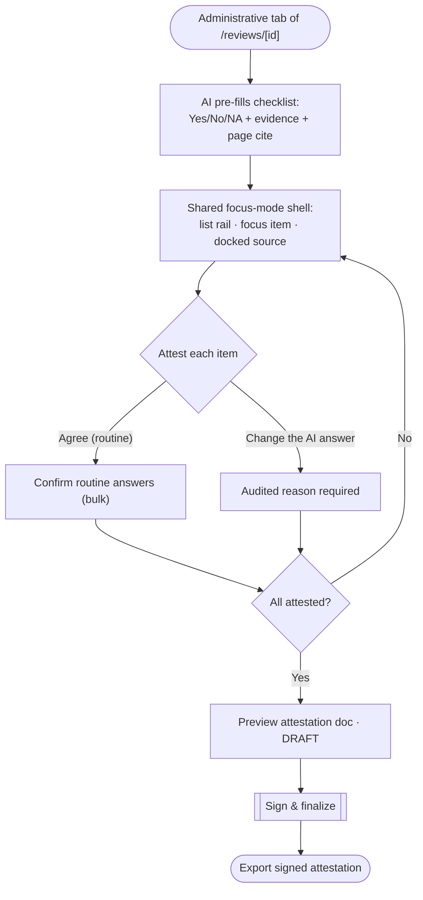
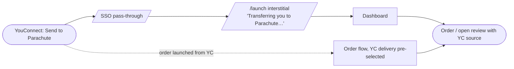

# Parachute v2 — Key User Flows

> The critical journeys, as Mermaid flowcharts. Reflects the Jun 16 2026 IA decisions
> (see the decisions log in `parachute-v2-ia-map.md`). Companion to the route map and
> the card-board (`parachute-v2-ia-board.html`).

---

## 1. Core loop — Order → Technical Review → Workbook

---

## 2. Intake triage — auto-rejected appraisals

---

## 3. Administrative Review — attestation (shared focus-mode shell)

---

## 4. YouConnect entry — embedded hand-off

---

## Notes

- **Quick-look drawer** (queue): clicking a review row peeks status / findings summary / next action / download; "Open review" enters flow 1 at the Findings step. Not a separate journey — an accelerator on the queue.
- **Notifications**: "review ready" / "returned" / "assigned" deep-link into the relevant flow above; email is the production channel (eng-owned), the in-app bell panel mirrors it.
- **Download** (PDF / DOCX / ZIP, DRAFT vs FINAL) is available from the context bar and queue rows at any lifecycle stage; FINAL only after sign.
